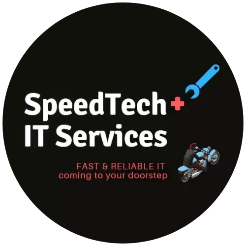

## 
My Portfolio

  

# 
Jericho L. Amargo

  <strong>IT Specialist | Web Developer | Graphic Designer</strong>
   
  <a href="CV_Amargo.pdf" download>Download CV</a>

## 
About

  I am a motivated and responsible professional with a mature approach to every task and assignment. As a recent IT graduate, I have honed my skills in collaboration, problem-solving, and time management. My consistent ability to meet deadlines and exceed expectations reflects my dedication and proficiency in the IT field. I am confident in my capability to excel in diverse IT roles, bringing a strong work ethic and a commitment to continuous learning and improvement.

## 
Education

  
  

    <strong>Batangas State University - The National Engineering University</strong>
     
    Bachelor of Science in Information Technology
     
    Major in Business Analytics
     
    <i>Cum Laude</i>
  

## 
Work Experience

<table border="0">
    <tr>
        <td></td>
        <td>
            <strong style="font-size: 20px;">SpeedTech IT Services</strong> 
            <strong style="font-size: 15px;">IT Support</strong> 
            August 2020 - 2022
            <ul>
                <li>Addressed customer inquiries, providing technical support and resolving issues efficiently.</li>
                <li>Conducted computer repair, upgrades, and maintenance for desktops and laptops.</li>
                <li>Designed logos, infographics, presentations, and posters to meet client specifications.</li>
            </ul>
        </td>
    </tr>
    <tr>
        <td></td>
        <td>
            <strong style="font-size: 20px;">Business Process Outsourcing International, Inc.</strong> 
            <strong style="font-size: 15px;">RPA Developer Intern</strong> 
            January - April 2024
            <ul>
                <li>Developed automation workflows using UiPath, C#, .NET for Outlook Mail processing.</li>
                <li>Created a Sales Invoice Detector project in Python for automated sales data extraction.</li>
                <li>Contributed to the development of a Client Hub Web Application using C# for improved client interaction.</li>
                <li>Utilized pgAdmin as a graphical user interface tool to interact with PostgreSQL databases, enhancing database administration tasks.</li>
                <li>Collaborated on cross-functional teams to gather requirements and implement tailored RPA solutions.</li>
                <li>Conducted testing, debugging, and documentation of RPA processes for reliability and scalability.</li>
            </ul>
        </td>
    </tr>
</table>

## 
Certifications

<table border="0">
    <tr>
        <td></td>
        <td>
            <strong style="font-size: 15px;">AWS Academy Cloud Foundations</strong>
        </td>
    </tr>
    <tr>
        <td></td>
        <td>
            <strong style="font-size: 15px;">AWS Academy Cloud Architecting</strong>
        </td>
    </tr>
    <tr>
        <td></td>
        <td>
            <strong style="font-size: 15px;">UiPath: Robotic Process Automations (RPA)</strong>
        </td>
    </tr>
    <tr>
        <td></td>
        <td>
            <strong style="font-size: 15px;">Data Science Foundations: Data Mining</strong>
        </td>
    </tr>
    <tr>
        <td></td>
        <td>
            <strong style="font-size: 15px;">Introduction to Business Analytics</strong>
        </td>
    </tr>
    <tr>
        <td></td>
        <td>
            <strong style="font-size: 15px;">Machine Learning with Python: Foundations</strong>
        </td>
    </tr>
    <tr>
        <td></td>
        <td>
            <strong style="font-size: 15px;">Python Functions for Data Science</strong>
        </td>
    </tr>
    <tr>
        <td></td>
        <td>
            <strong style="font-size: 15px;">Data Analytics for Students</strong>
        </td>
    </tr>
    <tr>
        <td></td>
        <td>
            <strong style="font-size: 15px;">Learning Data Analytics: 1 Foundations</strong>
        </td>
    </tr>
</table>
