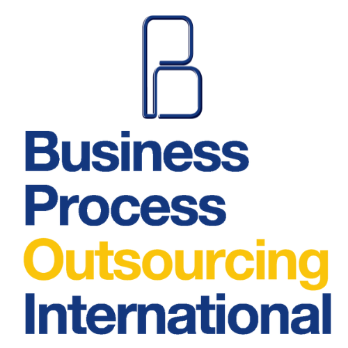

## 
My Portfolio

  

# 
Jericho L. Amargo

  <strong>IT Specialist | Web Developer | Graphic Designer</strong>
   
  <a href="CV_Amargo.pdf" download>Download CV</a>

## 
About

  Lorem Ipsum is simply dummy text of the printing and typesetting industry. Lorem Ipsum has been the industry's standard dummy text ever since the 1500s, when an unknown printer took a galley of type and scrambled it to make a type specimen book. It has survived not only five centuries, but also the leap into electronic typesetting, remaining essentially unchanged. It was popularised in the 1960s with the release of Letraset sheets containing Lorem Ipsum passages, and more recently with desktop publishing software like Aldus PageMaker including versions of Lorem Ipsum.

## 
Education

  
  

    <strong>Batangas State University - The National Engineering University</strong>
     
    Bachelor of Science in Information Technology
     
    Major in Business Analytics
  

## 
Work Experience

<table border="0">
    <tr>
        <td></td>
        <td>
            <strong style="font-size: 20px;">SpeedTech IT Services</strong> 
            <strong style="font-size: 15px;">IT Support</strong> 
            August 2020 - 2022
            <ul>
                <li>Addressed customer inquiries, providing technical support and resolving issues efficiently.</li>
                <li>Conducted computer repair, upgrades, and maintenance for desktops and laptops.</li>
                <li>Designed logos, infographics, presentations, and posters to meet client specifications.</li>
            </ul>
        </td>
    </tr>
    <tr>
        <td></td>
        <td>
            <strong style="font-size: 20px;">Business Process Outsourcing International, Inc.</strong> 
            <strong style="font-size: 15px;">RPA Developer Intern</strong> 
            January - April 2024
            <ul>
                <li>Developed automation workflows using UiPath, C#, .NET for Outlook Mail processing.</li>
                <li>Created a Sales Invoice Detector project in Python for automated sales data extraction.</li>
                <li>Contributed to the development of a Client Hub Web Application using C# for improved client interaction.</li>
                <li>Utilized pgAdmin as a graphical user interface tool to interact with PostgreSQL databases, enhancing database administration tasks.</li>
                <li>Collaborated on cross-functional teams to gather requirements and implement tailored RPA solutions.</li>
                <li>Conducted testing, debugging, and documentation of RPA processes for reliability and scalability.</li>
            </ul>
        </td>
    </tr>
</table>
